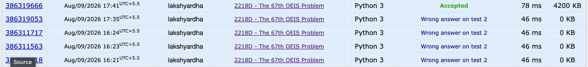
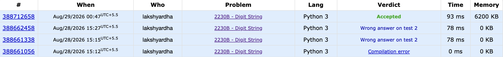
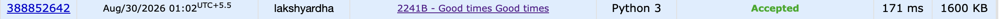

# problem 2218D:
->after many failed attempts...

-->A simple way to guarantee distinct adjacent GCDs is to use consecutive prime numbers p1, p2, ..., pn+1.
If we construct each element ai as the product of two adjacent primes:
ai = pi * pi+1

-->
import sys

def sieve(limit):
    is_prime = [True] * (limit + 1)
    is_prime[0] = is_prime[1] = False
    primes = []
    for i in range(2, limit + 1):
        if is_prime[i]:
            primes.append(i)
            for j in range(i * i, limit + 1, i):
                is_prime[j] = False
    return primes

# Precompute primes up to a sufficient limit (10005 primes needed)
PRIMES = sieve(120000)

def solve():
    input_data = sys.stdin.read().split()
    if not input_data:
        return
    
    t = int(input_data[0])
    results = []
    
    for k in range(1, t + 1):
        n = int(input_data[k])
        # Construct array a where a[i] = p_i * p_{i+1}
        a = [PRIMES[i] * PRIMES[i + 1] for i in range(n)]
        results.append(" ".join(map(str, a)))
        
    print("\n".join(results))

if __name__ == '__main__':
    solve()

# problem 2230B:
->delete some digits, and the digits that remain keep their original order.
  The remaining string is beautiful if NO subsequence of it forms a number divisible by 4.

# -> after failed attempt:
  ->Delete all occurrences of 4 immediately. Count how many 4s are deleted.
  In the remaining string (which contains only 1, 2, and 3):
             # We need to choose a split point such that all kept 2s are to the left of the split point, and all kept 1s and 3s are to the right.
             # To achieve this with minimal deletions:
                         * Delete all 1s and 3s to the left of the split point.
                         * Delete all 2s to the right of the split point.
                         * Find the optimal split point that minimizes (count of 1s and 3s to the left) + (count of 2s to the right).
  Initial state (divider at the extreme left):
            Left region is empty → left_13 = 0.
            Right region has the entire string → right_2 = filtered.count('2').
            Moving the divider past character c (shifting c from right to left):
  If c == '2': It leaves the right region, so right_2 decreases by 1.
  If c is '1' or '3': It enters the left region, so left_13 increases by 1.
->
import sys

def solve():
    input = sys.stdin.read
    data = input().split()
    
    if not data:
        return
    
    t = int(data[0])
    results = []
    
    for i in range(1, t + 1):
        s = data[i]
        
        # Step 1: Count and remove all '4's
        count_4 = s.count('4')
        filtered_s = [ch for ch in s if ch != '4']
        
        # Step 2: Total count of '2's in the filtered string
        total_2 = filtered_s.count('2')
        
        # Step 3: Find optimal split point
        # Left side will contain only '2's (so delete any '1' or '3')
        # Right side will contain only '1's and '3's (so delete any '2')
        
        left_13 = 0  # 1s and 3s on the left to delete
        right_2 = total_2  # 2s on the right to delete
        
        min_deletions = left_13 + right_2
        
        for ch in filtered_s:
            if ch == '2':
                right_2 -= 1
            else:  # '1' or '3'
                left_13 += 1
            
            min_deletions = min(min_deletions, left_13 + right_2)
            
        results.append(str(count_4 + min_deletions))
        
    print('\n'.join(results))

if __name__ == '__main__':
    solve()

# problem 2241B:
->Small Candidate Space:
The condition only requires finding any valid y. Small integers y∈[2,100] are predominantly good (for example, single-digit numbers 2..9 and repunits like 11,22,33,…,99 contain at most two distinct digits by definition).

->Density of Valid Answers:
For any given good number x, multiplying by small values of y (such as y=2,3,4,11,101) very frequently yields a product x×y that remains good.

->Deterministic Search:Instead of constructing a complex mathematical case-by-case formula, we can simply iterate through a small list of candidate y values. A simple check will find a valid y within the first few iterations for every valid input x.

-->
import sys

def is_good(n: int) -> bool:
    """Returns True if n contains at most 2 distinct digits."""
    return len(set(str(n))) <= 2

def solve():
    input_data = sys.stdin.read().split()
    if not input_data:
        return
    
    t = int(input_data[0])
    results = []
    
    # Pre-defined list of simple good numbers to test as candidate y values
    candidates = []
    # Single digits: 2, 3, ..., 9
    candidates.extend(range(2, 10))
    # Two-digit repunits: 11, 22, ..., 99
    candidates.extend([11 * i for i in range(1, 10)])
    # Power-of-ten pattern (101, 1001, 10001, etc.) and repunits (111, 1111, etc.)
    for length in range(3, 10):
        candidates.append(int('1' * length))
        candidates.append(int('1' + '0' * (length - 2) + '1'))
    
    for i in range(1, t + 1):
        x = int(input_data[i])
        
        # Find the first candidate y that makes (x * y) good
        for y in candidates:
            if is_good(x * y):
                results.append(str(y))
                break

    print('\n'.join(results))

if __name__ == '__main__':
    solve()

